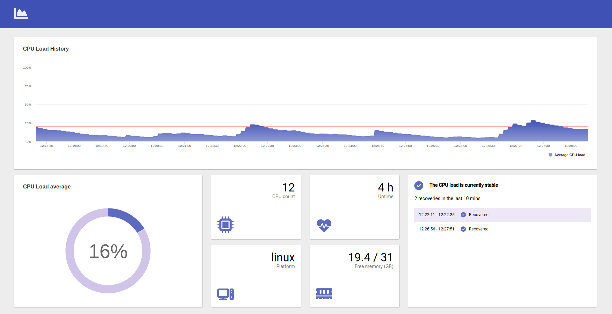

<div id="top"></div>

<!-- PROJECT LOGO -->
<br />
<div align="center">

  <h3 align="center">PERCEIVE</h3>

  <p align="center">
    Web-based CPU load monitoring app

</div>


<!-- ABOUT THE PROJECT -->
## About

Perceive is a web-based CPU load monitoring application. It tracks the current average CPU load and visualizes its changes across a 10 minute time window chart. Also, it show few other details about the system that it's running on, like the platform, uptime, cpu count, free and total memory.

<p align="right">(<a href="#top">back to top</a>)</p>


## Built with


* [Angular](https://angular.io/)
* [Higcharts](https://www.highcharts.com/)
* [Express.js](https://expressjs.com/)
* [Jasmine](https://angular.io/guide/testing)
* [SCSS](https://sass-lang.com/)
* [BEM](http://getbem.com/introduction/)


## Product requirements

- The front-end application should communicate with a local back-end service to retrieve CPU load average information from your computer (see below).
- The front-end application should retrieve CPU load information every 10 seconds.
- The front-end application should maintain a 10 minute window of historical CPU load information.
- The front-end application should alert the user to high CPU load.
- The front-end application should alert the user when CPU load has recovered.


#### Thresholds for high load and recovery:


- A CPU is considered under high average load when it has exceeded 1 for 2 minutes or more.
- A CPU is considered recovered from high average load when it drops below 1 for 2 minutes or more.

<p align="right">(<a href="#top">back to top</a>)</p>


<!-- GETTING STARTED -->
## Getting Started


### Prerequisites

* npm ( > v6.14.14)
* Node.js ( > v12.22.4)


### Run the local service API:


```sh
// Navigate to perceive/api and run:
   
npm install

// Start the server

npm run dev
   ```

### Run the front-end:


```sh
// Navigate to perceive/front-end and run:
   
 npm install

 // Start the front-end

 ng serve

 // Open a browser and navigate to http://localhost:4200/
   ```

## Testing

For smoother chart updates, the PUBLISH_INTERVAL threshold could be reduced to 1 second instead of the required 10 seconds:

```sh   
export const PUBLISH_INTERVAL = 1;
   ```

Note: The app was developed and tested mostly on Ubuntu by using Chrome, with few tests on Windows as well.

### Running the Jasmine unit tests:

```sh
// Navigate to the front-end directory and run
   
ng test
   ```

### Changing the thresholds

The thresholds for the duration and high CPU load can be easily changed by modifying their respective constants:

```sh   
export const CPU_HIGH_LOAD_THRESHOLD = 100;

export const CPU_HIGH_LOAD_DURATION = 120;
   ```


### For Ubuntu

On Ubuntu, there is an easy way to stress the CPU by calling something like this from the terminal:

```sh
stress --cpu 8
   ```


<p align="right">(<a href="#top">back to top</a>)</p>


<!-- ROADMAP -->
## Roadmap

This proof of concept could be further extended and optimized. Some ideas:

- Improve the test coverage for production and add e2e tests
- Introduce adjustable configuration for the duration and high load thresholds. A stepper component with increment and decrement funcitonality could be useful in this scenario
- Make use of the web Push API, which could push notifications to the web app from a server. This is especially good when the web app is not in the foreground
- Highlight the high CPU load ranges in the chart. One approach would be to use plot bands in Highcharts
- Allow users to zoom in on a selected area in the chart
- I18N for an improved localization and multi-language support
- In terms of product branding, the logo, colors and other assets need to be tweaked accordingly

<!-- PROJECT STRUCTURE -->
## Project structure
```text
├── back-end
│   ├── src
│   │   ├── app
│   │   │   ├── constants.ts
│   │   │   └── utils.ts
│   │   └── app.ts
├── front-end
│   ├── src
│   │   ├── app
│   │   │   ├── app.module.ts
│   │   │   ├── app-routing.module.ts
│   │   │   ├── home
│   │   │   │   ├── components
│   │   │   │   │   ├── chart
│   │   │   │   │   ├── cpu-load
│   │   │   │   │   ├── incidents
│   │   │   │   │   └── system-overview
│   │   │   │   │       ├── card-media
│   │   │   │   │       ├── cpu-count
│   │   │   │   │       ├── free-memory
│   │   │   │   │       ├── platform
│   │   │   │   │       └── uptime
│   │   │   │   └── home.module.ts
│   │   │   └── shared
│   │   │       ├── components
│   │   │       ├── constants
│   │   │       ├── interfaces
│   │   │       ├── services
│   │   │       └── utils.ts
│   │   ├── assets
│   │   │   ├── fonts
│   │   │   ├── images
│   │   │   ├── mocks
│   │   │   └── stylesheets
│   │   ├── environments
│   │   ├── index.html
│   ├── tsconfig.json
└── README.md

```

<!-- SCREENSHOTS -->
## Screenshots

### Stable state


### High load state


### Recovered state
